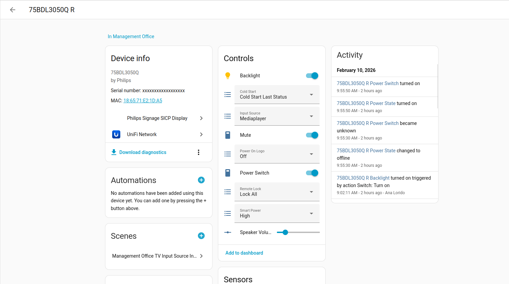

# Philips SICP for Implementation & Home Assistant Integration
For Philips Signage Displays supporting the Philips Signage Control Protocol (SICP).

This repository contains a Python implementation of the Philips Signage Control Protocol (SICP) called [SICPpy](src/sicppy/README.md) and a Home Assistant integration using it [sicp_homeassistant](src/sicp_homeassistant/README.md).

## Home Assistant Integration

Exposes controls and sensors to Home Assistant.

Also uses WoL to wake up powered-off displays (see smart power modes in the manual or SICP specification), exposing the combined on/off behaviour as `Power switch`.




## Home Assistant Integration install

### Production install via HACS
[](https://my.home-assistant.io/redirect/hacs_repository/?owner=rgon&repository=philips_sicp_py_ha&category=Integration)

### Development install
1. Requires: [uv](https://docs.astral.sh/uv/getting-started/installation/) package manager
2. Clone this repository
3. Sync the packages: `uv sync --all-packages --all-groups`. This will install dependencies onto a local .venv so you get IDE type hints.
4. Run the `release.sh` script
5. Copy the generated `dist/sicp_homeassistant.zip` file to your Home Assistant installation and unzip it into `custom_components/sicp_homeassistant`. Alternatively, you can install it via HACS using the local zip file option.

----

## CLI and SICPpy library

SICPpy also exposes a CLI to quickly interact with Philips Signage devices, as well as a programmatic API for building custom applications.

Scriptable, handy for configuring multiple displays at the same time.

```log
$: uv run python3 -m sicppy
Usage: sicppy <monitor_id|all> <command> [args]

Available monitors:
  0: Monitor ID 1: 192.168.xx.xxx
  1: Monitor ID 1: 192.168.xx.xxx

Commands:
  get_android_4k_state
     Get current Android 4K state.
  get_apm_mode
     Retrieve the current advanced power management mode.
  get_auto_signal_mode
     Retrieve the auto signal detection mode (SICP 2.05 onwards).
  get_av_mute
     Retrieve current A/V mute state.
  get_backlight_state
     Get current display backlight state.
  get_brightness_level
     Retrieve current brightness percentage via video parameters.
  get_cold_start_power_state
     Query cold-start power behavior.
  get_color_temperature_mode
  ...
```

Run `sicppy` without arguments to get a list of available commands and their description.

### Requirements
+ [uv](https://docs.astral.sh/uv/getting-started/installation/) package manager
+ Run cli: `uv run python3 -m sicppy` from the root of this repository
